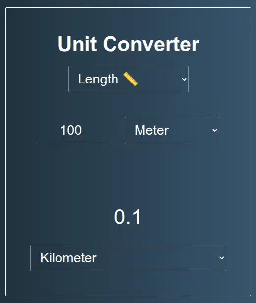

# Unit Converter
A simple Vanilla JavaScript application that convert measure values.

## How it works ⚙️

The application, written in VanillaJS requires user to insert a starting value in a number field, and an unit measure in select menu (on top).

On second select menu (on bottom) user can choose the unit measure that want to convert to. The convertion occurs automatically when user interact with select menus or insert / change the number field.

## Aviable Functionalities ✅
At moment, the application support the following functionalities:

- Temperature 🌡️ (Celsius, Fahrenheit and Kelvin)
